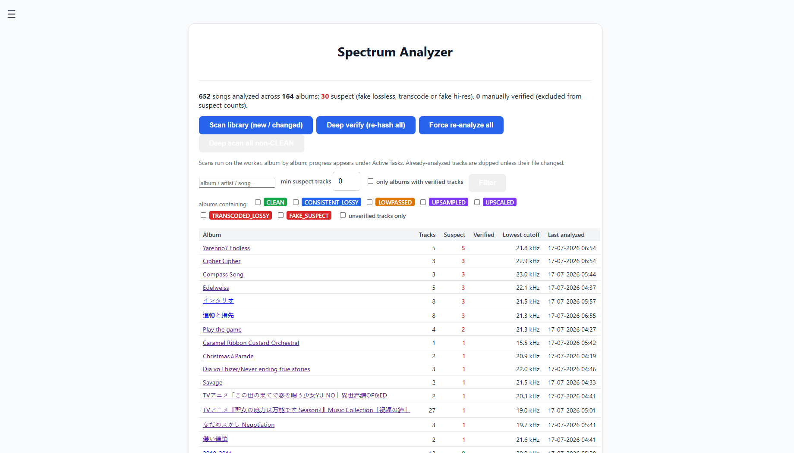
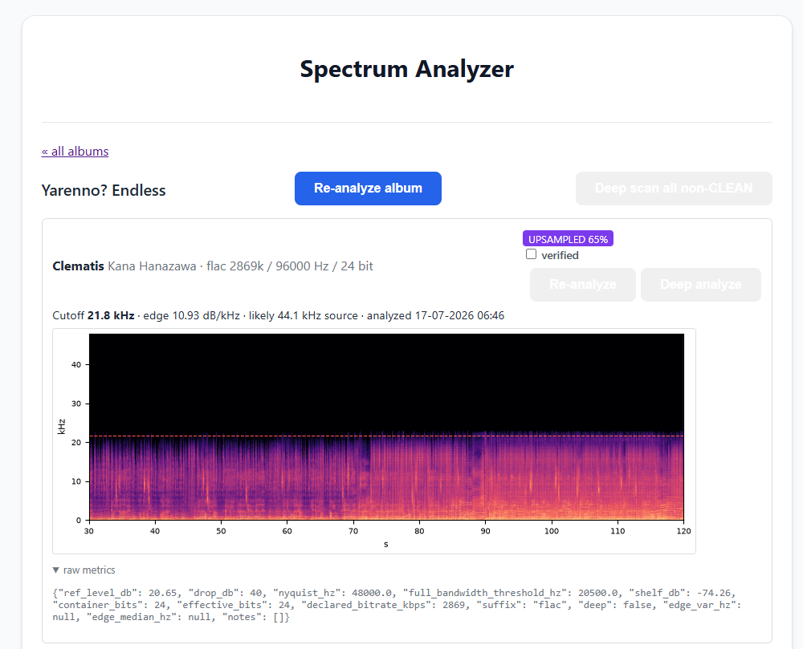
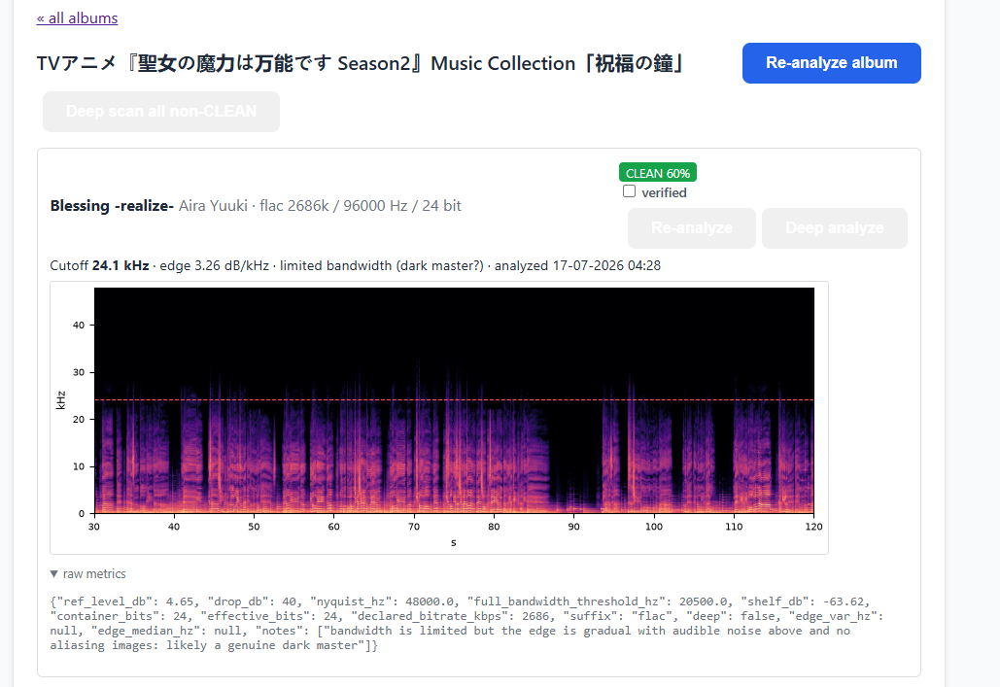
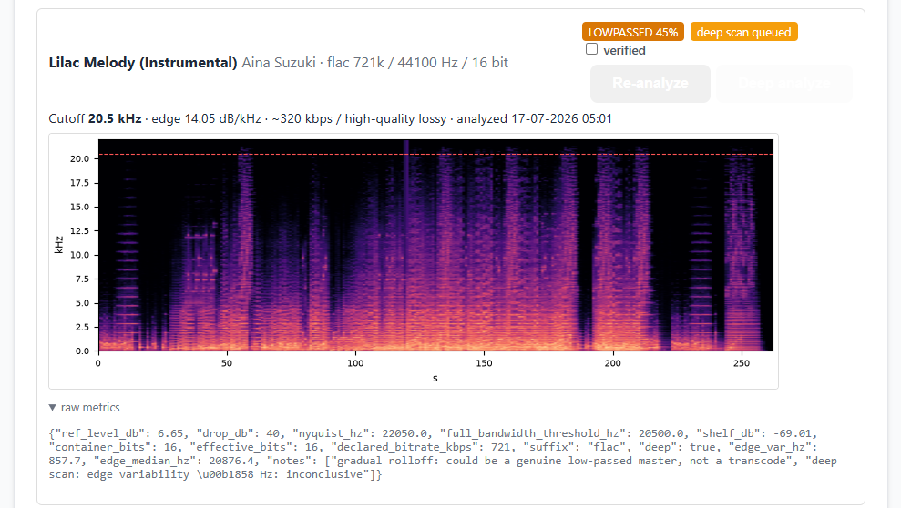

# SpectrumAnalyzer — AudioMuse-AI plugin

A plugin for Audiomuse-AI to run spectrum analysis over the whole library with fake-lossless / transcode detection and a stored spectrogram per song.

> [!CAUTION]
> This entire project is made with AI. Use at your own risk.

## What it does

- **Parallel library scan** — the scan is an orchestrator task (high queue) that fans out one task per album onto the default queue, so every worker picks up albums concurrently (same parent/child pattern as core analysis). The parent task under Active Tasks tracks albums done / remaining and aggregate counters; each album is its own sub-task. In *changed* mode, albums with nothing to do are settled by the orchestrator without spawning a task. Cancelling the parent stops new albums from being dispatched.
- **Each song analyzed once, re-analyzed only when the file changes** — two layers:
  1. *Metadata fingerprint* (path, size, suffix, bitRate, created…) from the media-server track object → unchanged tracks are skipped without downloading.
  2. *Audio MD5* of the downloaded bytes → if metadata changed but bytes didn't, only the fingerprint is refreshed; if bytes changed, full re-analysis.
- **Fake detection output per song** — frequency cutoff (Hz), edge sharpness (dB/kHz), noise-shelf level, container/effective bit depth, verdict (`CLEAN`, `CONSISTENT_LOSSY`, `LOWPASSED`, `UPSAMPLED`, `UPSCALED`, `TRANSCODED_LOSSY`, `FAKE_SUSPECT`), estimated source-bitrate class, confidence, raw metrics JSON. `FAKE_SUSPECT`, `TRANSCODED_LOSSY`, `UPSAMPLED` and `UPSCALED` count as suspect in the overview.
- **Spectrogram stored as base64 PNG** in the plugin's own Postgres table (`plugin_spectrum_analyzer__results`), rendered spek-style with a red line at the detected cutoff.
- **Reacts to the core cleanup task** — `item_id` is a foreign key to `score(item_id)` with `ON DELETE CASCADE` (same pattern as core's `embedding` tables), so when `tasks/cleaning.py` removes an orphaned track, its spectrogram row disappears too.
- **Manual re-run** — a Re-analyze button on every track (runs on the `high` queue) and a Re-analyze album button on each album page (one forced album task on the default queue), plus three scan modes: *changed* (default), *verify* (re-hash everything), *force* (redo everything).
- **Deep analyze** — a per-track button that scans the **entire file** (chunked, capped at 30 min) instead of the usual segment, and tracks the spectral edge second by second. A resampler/encoder wall sits at a constant frequency for the whole file; a genuine dark master's edge follows the music. Edge variance ≥ 500 Hz downgrades `UPSAMPLED`/`FAKE_SUSPECT` to `LOWPASSED` ("likely genuine dark master"); ≤ 150 Hz raises confidence in the machine-wall verdict. The stored spectrogram then covers the full track.
- **Manual verification** — a *verified* checkbox on every track for files you've checked by ear/eye (e.g. confirmed dark masters). Verified tracks are excluded from every suspect count, shown as a column on the overview, and filterable ("only albums with verified tracks"). Re-analysis keeps the flag.
- **Status tags** — queuing a deep scan tags the track ("deep scan queued", cleared automatically when the scan completes, even on failure). The overview shows per-album tags: amber "deep scan ×N" while scans are pending, green "verified ×N" for manually verified tracks.
- **Deep scan all non-CLEAN** — buttons on the album page (that album) and the overview (whole library) queue a deep scan for every track whose verdict isn't CLEAN, skipping verified and already-queued tracks; the overview reports how many were queued. Runs on the default queue so parallel workers share the load. Queueing is idempotent — while a track's "deep scan queued" tag is set, repeat clicks enqueue nothing (a plain Re-analyze clears a stuck tag).
- **Search** — the overview search box matches album, artist and song title, showing albums that contain a match.
- **Album filters** — the overview filters albums by the statuses their songs contain: one colored chip per verdict (any combination, e.g. "albums containing UPSAMPLED or FAKE_SUSPECT songs"), optionally matching unverified tracks only. Combines with a minimum unverified-suspect count and "only albums with verified tracks".
- **Bonus hook** — `on_song_analyzed` analyzes new songs for free during core analysis (the audio is already on disk; deduped by MD5). Toggleable in settings.
- **Optional cron** — a `plugin.spectrum_analyzer.scan_changed` schedule is seeded *disabled* (Sun 04:00); enable it under Administration → Scheduled Tasks for automatic incremental scans.

## Screenshots

**Library overview** — per-album suspect counts, scan buttons, free-text search (album / artist / song) and per-verdict filter chips:



**Fake hi-res caught** — a 96 kHz / 24-bit FLAC whose content stops at ~22 kHz: flagged `UPSAMPLED` (likely 44.1 kHz source), red dashed line at the detected cutoff:



**Genuine dark master spared** — also 96 kHz with limited bandwidth, but the gradual edge, audible noise above the cutoff and absence of aliasing images keep it `CLEAN` with a "dark master?" note:



**Deep scan** — whole-file analysis (note the full-track spectrogram) with the per-second edge-variability verdict in the raw metrics, and the amber "deep scan queued" status tag:



## How the fake detection works

A 90 s segment from the middle of the track is loaded at native sample rate, STFT'd (n_fft 4096), and reduced to a robust per-frequency "max hold" profile (95th percentile over time). The cutoff is the highest frequency still within 40 dB of the 1–8 kHz reference level. A lossy encoder's low-pass leaves a near-vertical wall (high dB/kHz edge) with digital silence above it; a genuine master rolls off gradually and keeps dither/analog noise above the rolloff. Verdict logic:

- cutoff ≥ ~93 % of Nyquist (capped at 20.5 kHz) → `CLEAN` — genuine 44.1 kHz masters legitimately roll off at 20–21 kHz (anti-alias filters, mastering chains), and edge sharpness measured against the Nyquist wall means nothing
- **except** in a hi-res container (> 48 kHz): a cutoff aligning with a standard lower rate's Nyquist (22.05 / 24 / 44.1 / 48 kHz ± 5 %) — or sitting below 23 kHz at all — means a resampled source → `UPSAMPLED` (fake hi-res). Confidence 0.5 base, +0.25 for a sharp edge, +0.15 for digital silence above the cutoff. When there *is* content above the cutoff, it's checked for **aliasing images**: if it mirrors the band below the cutoff (correlation ≥ 0.6), it's a resampler artifact and confidence jumps to 0.9; otherwise it gets a "could be a genuine but dark master" note
- **bit-depth check** (independent of the spectrum): PCM samples are probed for zero-padded low bits. A > 16-bit container carrying ≤ 16 effective bits is fake 24-bit → `UPSCALED` (0.95 — the signature is deterministic) when the spectrum is otherwise clean, or a note on the existing verdict otherwise. Effective/container bits are stored per track and shown on the album page (e.g. "16→24 bit" in red)
- lossless container + low cutoff + sharp edge + **silent shelf** above the cutoff → `FAKE_SUSPECT` (estimated source class, e.g. "~128 kbps")
- lossless container + sharp edge but audible noise above the cutoff → `LOWPASSED` (an encoder wall leaves digital silence; noise points at a genuine low-passed master)
- lossless container + gradual rolloff → `LOWPASSED` (lower confidence)
- lossy container whose cutoff is far below what its declared bitrate should reach → `TRANSCODED_LOSSY`
- otherwise → `CONSISTENT_LOSSY`

These are heuristics — treat `FAKE_SUSPECT` as "look at the spectrogram," not a conviction. Thresholds are calibrated against real ground-truth fixtures (see `tests/`): LAME 320 kbps transcodes (cutoff ~20.1 kHz, dither-only shelf) are caught, but very-high-bitrate transcodes whose cutoff reaches ≥ 20.5 kHz (e.g. AAC 256) still read as CLEAN — spectrally indistinguishable from a genuine master, and false accusations are worse.

### Reading the raw metrics (the "details" JSON)

Every track page has a collapsible **raw metrics** panel — the full evidence behind the verdict, as JSON. It's grouped into sections; each fact lives in exactly one section, and a value of `null` always means "not checked for this track" (as opposed to `false`, which means "checked, and no").

**Top level** — numbers that describe the analyzed segment itself:

| Field | Meaning |
|---|---|
| `nyquist_hz` | Half the sample rate — the highest frequency the file could possibly contain. |
| `full_bandwidth_threshold_hz` | The cutoff frequency above which a track counts as "full bandwidth" (near `nyquist_hz`, capped at 20.5 kHz). |
| `ref_level_db` / `shelf_db` | How loud the 1–8 kHz "reference" band is, and how loud the band *above* the cutoff is relative to it. A very quiet shelf (`shelf_db` far below zero) means near-silence above the cutoff — see `shelf_digitally_silent` below. |
| `drop_db` | The threshold used to find the cutoff: the point where content falls this many dB below the reference level. |
| `declared_bitrate_kbps` / `suffix` | What the file claimed to be (from its metadata/extension), used to sanity-check the measured cutoff. |
| `deep` | Whether this was a full-file "Deep analyze" (`true`) or a normal multi-window sample (`false`). |
| `edge_var_hz` / `edge_median_hz` | Deep-scan only: how much the cutoff frequency wanders second-to-second. A constant edge means a machine-made wall; a wandering edge means it's just following the music. |
| `analysis_rev` | Internal version stamp — which revision of the detection logic produced this row. |
| `notes` | Plain-English explanations for the verdict (e.g. "sharp edge but audible noise above the cutoff"). |

**`bit_depth`** — is the file's declared bit depth real?

| Field | Meaning |
|---|---|
| `container_bits` | The bit depth the file claims (e.g. 24-bit). |
| `effective_bits` | The bit depth actually being used (e.g. only 16 real bits, the rest padded with zeros). A mismatch here is what triggers `UPSCALED`. |

**`integrity`** — how much of the file was actually decoded:

| Field | Meaning |
|---|---|
| `status` | `sampled_decode_ok` (normal scan, a few windows read), `full_decode_ok` (deep scan, whole file read), `decode_failed` (file couldn't be opened), or `unsupported` (DSD — deliberately not analyzed). |
| `coverage` | How much of the file that status is based on: `sampled`, `partial`, `capped` (deep scan hit its time limit), or `full`. |

**`delivery`** — what codec is actually inside the file (`null` if there's nothing to report — suffix and content agree and no codec was probed):

| Field | Meaning |
|---|---|
| `codec` | The actual codec detected (e.g. `mp3`, `alac`) when it differs from a simple guess-by-extension. |
| `codec_mismatch` | Set when the file extension lies about the format (e.g. a `.m4a` file that's actually lossless ALAC, or vice versa). |

**`windows`** — multi-window sampling detail (`null` in deep-scan mode, which doesn't use windows):

| Field | Meaning |
|---|---|
| `samples` | One entry per sampled window (spread through the track): its offset/length, the cutoff frequency found there, and whether it was too quiet to trust (`silent`). The *worst* (lowest-cutoff) window is what drives the verdict — one bad passage can't be averaged away. |
| `agree` | `true` if all the windows found roughly the same cutoff, `false` if they disagree (worth a manual look / deep scan), `null` if there weren't enough usable windows to compare. |

**`evidence`** — specific clues checked while forming the verdict (see the table below; all nullable — `null` means that check didn't run for this file):

| Field | Plain-English question | What it means |
|---|---|---|
| `edge_machine_like` | Does the sound cut off like a wall, or fade out naturally? | `true` = sharp, encoder-style cutoff; `false` = gradual, natural rolloff; `null` = not enough spectrum above the cutoff to tell. |
| `shelf_digitally_silent` | Is there true silence above the cutoff, or just quiet noise? | `true` = digital silence (a transcode/fake signature); `false` = real noise floor present (points to a genuine recording); `null` = nothing measurable above the cutoff. |
| `alias_image_detected` | Does the noise above the cutoff mirror the sound below it? | `true` = yes, a resampler artifact (strong upsampling proof); `false` = checked, no mirroring found; `null` = this check only runs when a track is already a hi-res-upsample candidate, so most tracks never reach it. |
| `narrow_high_frequency_tone_present` | Is there one odd narrow spike high in the spectrum? | `true` = an isolated tone was found and excluded from the cutoff measurement (so it can't fake extra bandwidth); `false` = none found; `null` = not evaluated. |

None of these fields change what verdict a track gets by themselves — they're the paper trail for the verdict the detection logic already reached.

## Install (local repository, per the official docs)

1. Run `./build.sh [version]` — it packages the plugin code into `dist/spectrum_analyzer-<version>.zip` and points the matching `plugin.json` entry's `sourceUrl` at it. Without an argument the version is taken from the newest zip in `dist/` (or `plugin.json` on a fresh checkout).
2. Edit `plugins/SpectrumAnalyzer/plugin.json` and `manifest.json`: replace the host in the URLs with an address your AudioMuse containers can reach (for LAN serving; the committed files point at this repo's GitHub raw URLs, which work as-is).
3. For LAN serving: `python3 -m http.server 8120` in the **repo root**; otherwise just add the GitHub raw `manifest.json` URL.
4. AudioMuse-AI → Plugins → Repositories → add `http://<your-ip>:8120/manifest.json`.
5. Install from the Catalog tab, then **Apply now (restart)**.

`matplotlib` is pulled in automatically at install (`requirements` in plugin.json) — this means **Docker/Kubernetes only**; the standalone builds can't install extra pip packages.

## Development

```bash
# 1. unit tests (real DSP code against committed ground-truth fixtures)
python3 -m pip install --user numpy soundfile matplotlib   # once
python3 -m unittest discover tests -v

# 2a. dev loop: rebuild the fixed local-catalog zip (serve dist-local/ and add
#     its manifest.json as a repository in AudioMuse; reinstall to pick up changes)
./build.sh local                                            # -> dist-local/spectrum_analyzer.zip

# 2b. build a release package (versioned; no arg = reuse newest dist/ version)
./build.sh 0.2.0                                            # -> dist/spectrum_analyzer-0.2.0.zip

# 3. release (CI/CD): open a PR that changes the code AND adds a new top entry
#    (version + changelog) to plugins/SpectrumAnalyzer/plugin.json (history:
#    CHANGELOG.md). CI runs the tests on every PR update; when the PR is
#    MERGED into main, it verifies every published zip still matches its
#    checksum, fails if plugin code changed without a version bump, then
#    builds dist/spectrum_analyzer-<version>.zip, writes the entry's
#    sourceUrl + md5 checksum, and commits the result back. Published versions
#    are immutable (locally, build.sh refuses to rebuild too; FORCE=1 only for
#    never-published versions).
```

See `tests/README.md` for the fixture set, ad-hoc analysis of arbitrary files
(`tests/run_verdicts.py`), fixture regeneration, and the measured calibration
constants behind the detection thresholds.

## Notes & caveats

> [!IMPORTANT]
> **AudioMuse-AI 3.0**: fully supported since plugin 0.3.0 (works on 2.6.2 too). v3 keys its `score` table by canonical fingerprint ids; the plugin translates native media-server ids at the edges and migrates existing data losslessly (FK `ON UPDATE CASCADE` rides the core's id relabel).
>
> **Upgrading from 2.x: update the plugin *before* upgrading the core.** If your 3.0 upgrade appears stuck at boot with a foreign-key error mentioning `plugin_spectrum_analyzer__results`, update the plugin and Apply restart — the next boot completes the core migration with your plugin data intact. Multi-server installs: a manual library scan covers every configured server; re-analysis and deep scans download from the server that supplied the track; cron scans follow the schedule's server scope.

- **Only tracks already analyzed by core AudioMuse** get spectrum rows during a scan (the FK requires a `score` row). Un-analyzed tracks are counted as `not_in_score` and get picked up automatically by the hook when you run core analysis.
- **Navidrome transcoding**: tracks are fetched via the Subsonic `stream` endpoint. Make sure the AudioMuse player/client in Navidrome has **no transcoding profile** ("raw"), otherwise you'd be analyzing the transcode, not the file.
- **Database size**: at the default 800×280 px, a spectrogram is roughly 100–300 KB of base64. 10 000 songs ≈ 1–3 GB in Postgres. Tune the image size in settings if that matters; deleting rows for an album and rescanning regenerates them.
- **Verify mode** downloads every track (to hash it) — heavy on a big library over the network; use it when you suspect in-place file edits that Navidrome metadata wouldn't reveal.

## License

AGPL-3.0-only (same as AudioMuse-AI core, and required for the community plugin catalog). See [LICENSE](LICENSE).

## Files

- `plugins/SpectrumAnalyzer/__init__.py` — blueprint, pages (album overview with suspect filters, per-album detail), settings, migration, `register(ctx)`
- `plugins/SpectrumAnalyzer/jobs.py` — scan orchestrator + per-album child tasks, single-track re-run, fingerprints, hook, DB upsert
- `plugins/SpectrumAnalyzer/dsp.py` — STFT profile, cutoff/edge/shelf/aliasing/bit-depth metrics, verdict, deep scan, spectrogram PNG
- `build.sh` → `dist/spectrum_analyzer-<version>.zip` — the flat code zip AudioMuse installs (run by CI on push to main)
- `plugins/SpectrumAnalyzer/plugin.json` — the plugin descriptor (community-catalog layout: it lives next to the code, so the folder is a drop-in PR payload)
- `manifest.json` — self-hosted catalog pointing at the descriptor (`CHANGELOG.md` holds the version history)
- `tests/` — out-of-the-box unit tests, committed ground-truth fixtures, fixture generator, ad-hoc verdict runner
- `image/` — README screenshots
